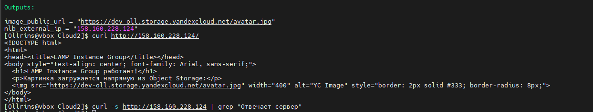
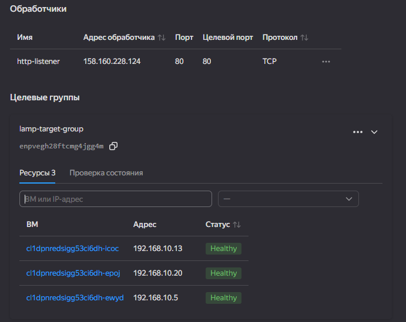

## Домашнее задание к занятию «Вычислительные мощности. Балансировщики нагрузки»

## Задание 1. Instance Group и Network Load Balancer в Yandex Cloud

### Файлы манифестов
- [main.tf](main.tf)
- [variables.tf](variables.tf)
- [providers.tf](providers.tf)

### Описание действий
1. В существующий бакет Object Storage `dev-oll` загружено изображение `avatar.jpg`.
2. Создана группа безопасности `ig-lamp-sg`, разрешающая входящий трафик на порты 80 (HTTP) и 22 (SSH).
3. Создана Instance Group `lamp-instance-group` фиксированного размера (3 ВМ) на базе образа LAMP (`fd827b91d99psvq5fjit`).
4. Через `cloud-init` (параметр `user_data`) на каждой ВМ установлен Apache и сгенерирована веб-страница `/var/www/html/index.html`, содержащая ссылку на изображение из Object Storage и имя хоста (`hostname`).
5. Настроен Network Load Balancer с привязкой к автоматически созданной Target Group и проверкой состояния (health check) по порту 80.
6. Проведена проверка отказоустойчивости путем ручного удаления ВМ из группы.

### Выполнение и проверка

    <em>Рисунок 1 - Изображение avatar.jpg, успешно загруженное в бакет Object Storage</em> 

    <em>Рисунок 2 - Веб-страница, отдаваемая Network Load Balancer, с корректно подгружаемым изображением из Object Storage</em> 

    <em>Рисунок 3 - Целевая группа (Target Group) балансировщика: все 3 виртуальные машины имеют статус Healthy</em> 

